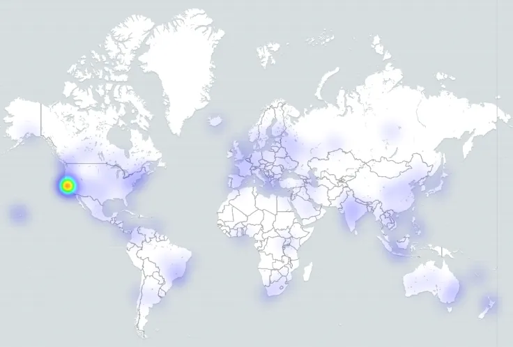

# Contributor Location

Question: What is the location of contributors?

## Description

Geographical location from which contributors contribute, where they live, or where they work.

## Objectives

To determine global locations of contributors in an effort to understand work practices and times zones. To identify where contributions do not come from in an effort to improve engagement in these areas.

## Implementation

### Filters

Filter contributions by:

* **Location.** Attempt to group locations in regions to have multiple levels of reporting. Location is a purposely ambiguous term in this context, and could refer to region, country, state, locale, or time zone.
* **Period of time.** Start and finish date of the period. Default: forever. Period during which contributions are counted.
* **Type of contributor**, for example:
  * Repository authors
  * Issue authors
  * Code review participants
  * Mailing list authors
  * Event participants
  * IRC authors
  * Blog authors
  * By release cycle
  * Programming languages of the project
  * Role or function in project

### Visualizations

Dot Density Map:

Source: [https://chaoss.biterg.io/goto/a62f3584a41c1c4c1af5d04b9809a860](https://chaoss.biterg.io/goto/a62f3584a41c1c4c1af5d04b9809a860)

Visual heat map:

Source:  [https://blog.bitergia.com/2018/11/20/ubers-community-software-development-analytics-for-open-source-offices](https://blog.bitergia.com/2018/11/20/ubers-community-software-development-analytics-for-open-source-offices)

### Tools providing the metric

*   GrimoireLab
*   Augur

### Data Collection Strategies

Different approaches can be used to collect information about location:

*   Collect the location information from a contributor’s profile in the system of engagement.
*   Use IP address geolocation of the most frequent locations that contributions are made.
*   Infer geographical location from the timestamp in contributions.
*   Survey contributors.

The key challenge for collecting data is determining the location of the contributor. Best practice would be to leverage any profile information available from the system of engagement, and if that is not available then use IP geolocation to determine the most frequent location of contribution from that individual. Note that contributors may enter in their profile information false or nonsensical location information (e.g., “Earth” or “Internet”). Note that IP geolocation can provide large numbers of false positives due to use of VPNs or other IP masking tools.

An additional consideration would be the use of external data collection tools such as community surveys or event registration data that could cross reference systems of engagement profiles. Contributor location data could be collected inline with event [attendee demographics](https://chaoss.community/metric-attendee-demographics/) and [speaker demographics](https://chaoss.community/metric-speaker-demographics/).

## References

*   Gonzalez-Barahona, J. M., Robles, G., Andradas-Izquierdo, R., & Ghosh, R. A. (2008). Geographic origin of libre software developers. _Information Economics and Policy_, _20_(4), 356-363.
