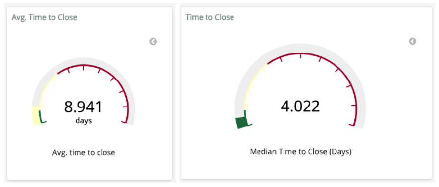

# Time to Close  

Question: How much time passes between creating and closing an operation such as an issue, change request, or support ticket?   

## Description  
The time to close is the total amount of time that passes between the creation and closing of an operation such as an issue, change request, or support ticket. The operation needs to have an open and closed state, as is often the case in code review processes, question and answer forums, and ticketing systems.    

Related metric: [Issue Resolution Duration](https://chaoss.community/metric-issue-resolution-duration/)      

## Objectives  
1. Determining how responsive a community is can help efforts to be inclusive, attract, and retain new and existing contributors.   
2. Identifying characteristics of operations that impact an operation closing quickly or slowly (e.g., finding best practices, areas of improvement, assess efficiency).   
3. Identifying bias for timely responses to different community members.   
4. Detecting a change in community activity (e.g., to indicate potential maintainer burnout, reduction in the diversity of contributions)   
5. Understand how the time to close an issue or change request is related to merge success or failure.

## Implementation  

### Filters  

* Creator of operation (e.g., new contributor vs. maintainer)  
* First closed, final closed   
* Labels (e.g., bug vs. new feature)
* Change Request Merge Status (e.g. Time to Merge or Time to Close without Merge)

### Visualizations  

  

### Tools Providing the Metric  

Augur implementation:   
* [Issue Close Duration](http://augur.osshealth.io/api_docs/#api-Evolution-Closed_Issue_Resolution_Duration(Repo))   
* [Issue Duration](http://augur.osshealth.io/api_docs/#api-Evolution-issue-duration-repo )   
* [Issue Response Time](http://augur.osshealth.io/api_docs/#api-Evolution-Issue_Response_Time(Repo))  

GrimoireLab implementation:  
* [Pull Requests Efficiency](https://chaoss.github.io/grimoirelab-sigils/panels/github-pullrequests-efficiency/)  
* [Issues Efficiency](https://chaoss.github.io/grimoirelab-sigils/panels/github-issues-efficiency/)  
* [Efficiency:TimingOverview](https://chaoss.github.io/grimoirelab-sigils/panels/efficiency-timing-overview/)  

### Data Collection Strategies

The time to close metric may be contextual based on the project activity and objectives. For example, the time to close a bug report may provide different information than the time to close a new feature request. Data collection strategies should address different project objectives. Other variables that may influence these processes are:  
* Issue Tracking Systems: the type of issue such as bug report, blueprint (OpenStack nomenclature), user story, feature request, epic, and others may influence how long this event takes to be closed. Other variables, such as the priority or severity may help to advance how quickly this event will be closed.  
* Change Request Processes: this depends on the change request infrastructure, as Gerrit, GitHub or mailing lists (as in the Linux Kernel) and may differ depending on how complicated the process is. For example, newcomers or advanced and experienced developers will proceed in different ways and with more or less time required.  
* Question and Answer Forum: this depends on the quality of the answer and the opinion of the person asking the question. A valid answer is marked, and the process is closed once the person questioning has successfully found a correct answer to their question.  

## References
* “Practice P.12: Respond to all submissions” from “Appendix to: Managing Episodic Volunteers in Free/Libre/Open Source Software Communities” by Ann Barcomb, Klaas-Jan Stol, Brian Fitzgerald and Dirk Riehle: https://opus4.kobv.de/opus4-fau/frontdoor/index/index/docId/13519  
