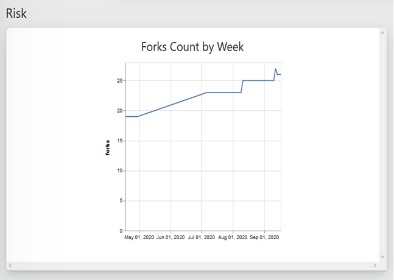
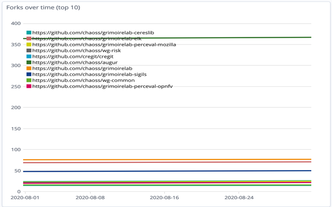

###This metric is a release candidate To comment on this metric please see Issue #xx Following a comment period, this metric will be included in the next regular release.

# Technical Forks
Question: What are a number of technical forks of an open source project on code development platforms?

## Description
A technical fork is a distributed version control copy of a repository. Number of technical forks indicates the number of copies of that project on the same code development platform. Technical fork metric indicates how many people created a distributed copy of the repository to a different account or organization on the code development platform. 

Technical forks may provide insight into forking intentions (different types of forks such as contributing, and non-contributing forks) however we can’t measure intentions at this level. This analysis would likely be post-hoc.

## Objectives
The objective of the Technical Fork metric is to ascertain how many people have copied a repository. 

People fork a repository either to make changes and contribute them back to the original project or maintain changes to their unique one; they create a copy of the project to further develop a separate project off from the existing project. Creating a copy and starting a new project from a fork may create a risk that a project community splits. 

## Implementation

### Filters
* Time Period (e.g., Weekly, Monthly, Annually)
* Ratio of contributing fork to total forks (A contributing fork is any fork that has ever opened a change request against the original repository.)
* Ratio of non-contributing fork to total fork (A non-contributing fork is any fork that has ever opened a change request against the original repository.)

### Visualizations
**Augur Implementation**

**GrimoireLab Implementation**

### Tools Providing the Metric
Augur
GrimoireLab

### Data Collection Strategies
**Github API** 
https://developer.github.com/v3/repos/forks/#list-forks

**GitLab API**
https://docs.gitlab.com/ee/api/projects.html#list-forks-of-a-project

**Bitbucket API**
https://developer.atlassian.com/bitbucket/api/2/reference/resource/repositories/%7Bworkspace%7D/%7Brepo_slug%7D/forks

## References
https://help.github.com/en/enterprise/2.13/user/articles/fork-a-repo
https://opensource.com/article/17/12/fork-clone-difference

