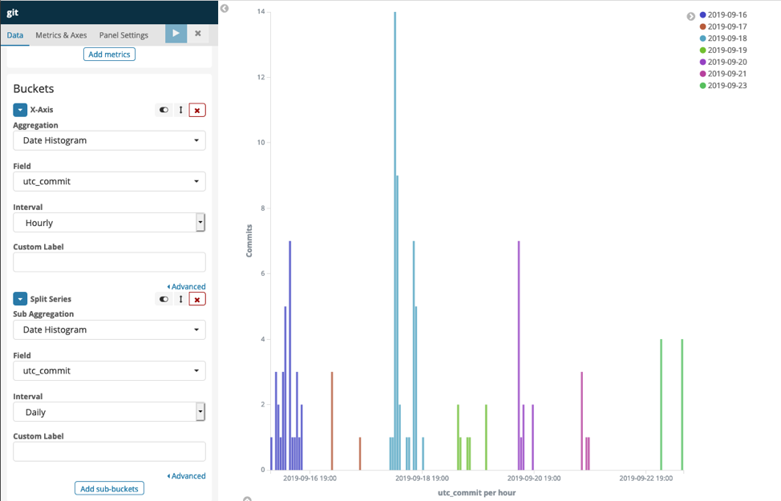
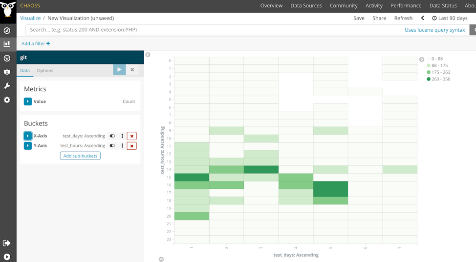

# Activity Dates and Times

Question: What are the dates and timestamps of when contributor activities occur?

## Description

Individuals engage in activities in open source projects at various times of the day. This metric is aimed at determining the dates and times of when individual activities were completed. The data can be used to probabilistically estimate where on earth contributions come from in cases where the time zone is not UTC. 

## Objectives

* Improve transparency for employers about when organizational employees are engaging with open source projects
* Improve transparency for open source project and community managers as to when activity is occurring 

## Implementation

### Filters
* Individual by Organization
* Aggregation of time by UTC time 
  - Can show what times across the globe contributions are made; when the project is most active.
* Aggregation of time by local time
  - Can show what times of day in their local times they contribute. Conclusions about the If contributions are more during working hours, or if contributions are more during evening hours.
* Repository ID

### Visualizations

### Tools Providing Metric

[GrimoireLab](https://chaoss.github.io/grimoirelab/)

[Augur Date/Timestamps](https://docs.augur.net/#dates-timestamps)

## References

[Coordinated Universal Time](https://en.wikipedia.org/wiki/Coordinated_Universal_Time)
