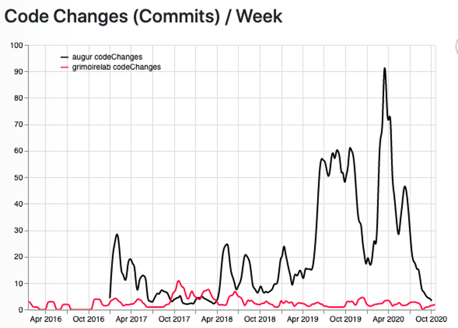

# Burstiness

Question: How are short timeframes of intense activity, followed by a corresponding return to a typical pattern of activity, observed in a project?

## Description
There are a number of reasons that may prompt a sudden increase or decrease in the amount of activity within a repository. These increases and decreases appear both as a sudden change in activity against the average amount of activity. Burstiness is a way of understanding the cycle of activity in existing metrics, like issues, merge requests, mailing lists, commits, or comments. Examples of root causes for bursts in activity include:

 - Release cycles
 - Global pandemics
 - Hackathon activities
 - Mentorship programs
 - Conferences, meetups, and other events where tools are presented
 - Conventional and social media announcements and mentions
 - Critical bugs as raising awareness and getting people’s attention
 - Community design meetings or brainstorming meetings to address a particular issue
 - Community members show up from another community that is relying on your project (e.g., dependencies)

## Objectives
 - To identify impacts of root causes of a burst in activity
 - To provide awareness when project activity unknowingly goes up
 - To help capture the meaningfulness of increases or decreases in project activity
 - To help the community and maintainers prepare for future bursts that follow a pattern
 - To help measure the impact of influential external activities
 - To differentiate skewed activity versus normal activity

## Implementation
### Filters
 - Stars
 - Forks
 - Issues or bug reports
 - Labels
 - Downloads
 - Release Tags
 - Change Requests
 - Mail List Traffic
 - Documentation additions or revisions
 - New Repositories
 - Feature Requests
 - Messaging Conversations
 - Conventional and Social Media Activity
 - Conference Attendance and Submissions

### Visualizations

Augur:

GrimoireLab:

### Tools Providing the Metric
- Grimoire Lab
- Augur

### Data Collection Strategies
- Quantitative
  * Time box activities identifying deviations away from some norm
  * Outliers for certain thresholds, using statistics like Bollinger Bands to measure stability or volatility: https://en.wikipedia.org/wiki/Bollinger_Bands

- Qualitative Interview Questions
  * Why do you contribute more during a period of time?
  * What do you believe to be the root cause for particular bursts?
  * What impact do different events (e.g., hackathons, mentorship program, or conferences) have on project activity?

## References
This metric was inspired by the work of Goh and Barabasi (2008): https://arxiv.org/pdf/physics/0610233.pdf
